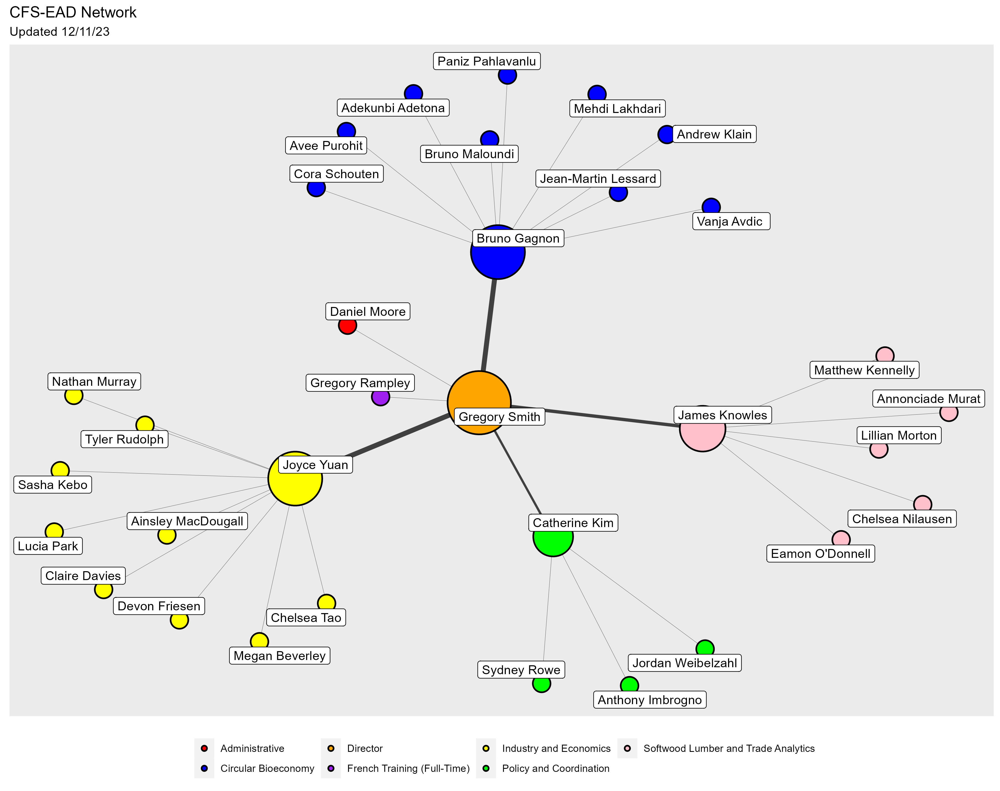

# CFS-EAD Network Visualization

**Introduction**

Networks enable the visualization and analysis of connections (relationships) between data points. Networks consist of two elements: vertices (or nodes) which represent objects or people within the network and their associated attributes, and edges (or links) representing the connection(s) between the vertices. Vertices are represented by a specified shape, and edges are represented by lines extending from one vertex to another. Networks can be applied to a wide variety of social, economic, and biological analyses to help understand relationship structures within a given context.

**Description**

This R script produces a network visualization of all current employees in the Canadian Forest Service - Economic Analysis Division (CFS-EAD) as of December 11, 2023.

The representation of the network is presented on the plane using a force-directed Fruchterman-Reingold layout algorithm, resulting in adjacent/connected vertices (i.e. employees within the same team) positioned near each other and non-adjacent vertices positioned further apart. Employees are grouped and colour-coded by team. The size of vertices and the width of connecting edges are scaled based on betweenness centrality (i.e. number of geodesic (shortest path) connections).

**Input Data Sources**

Both the vector and edge list are author-created and refer to information provided by the [EAD Organizational Chart](https://041gc.sharepoint.com/:p:/r/sites/CFS-SCF/_layouts/15/Doc.aspx?sourcedoc=%7B63C0E5C1-9147-4E81-B00D-38447E11205B%7D&file=CFS%20-%20EAD%20-%20Org%20Chart.pptx&action=edit&mobileredirect=true). Vector attributes include employee name, team, and job title (not visualized). The edge list contains connections from directors to managers, and managers to employees.

**Results**

{width="559"}
